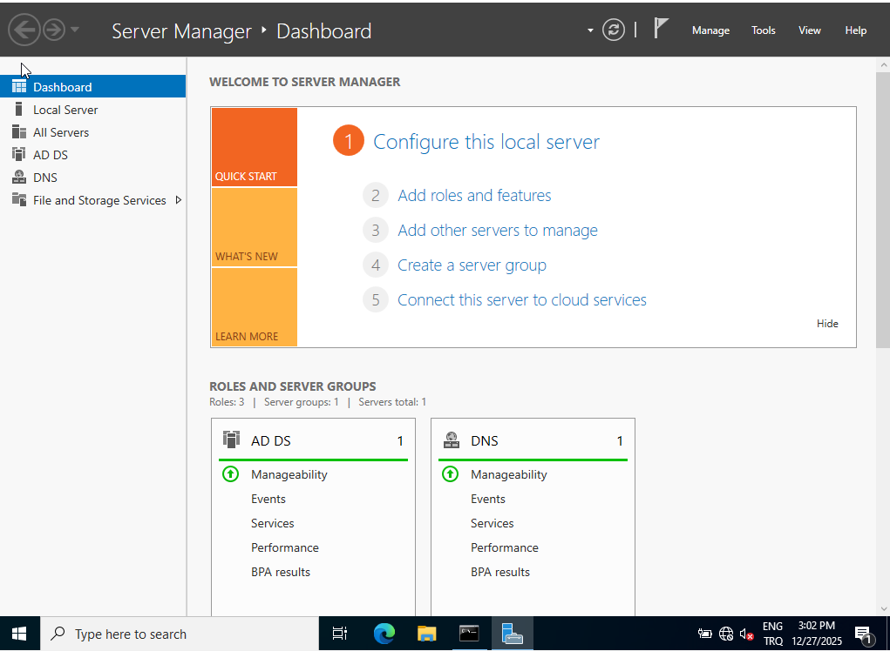
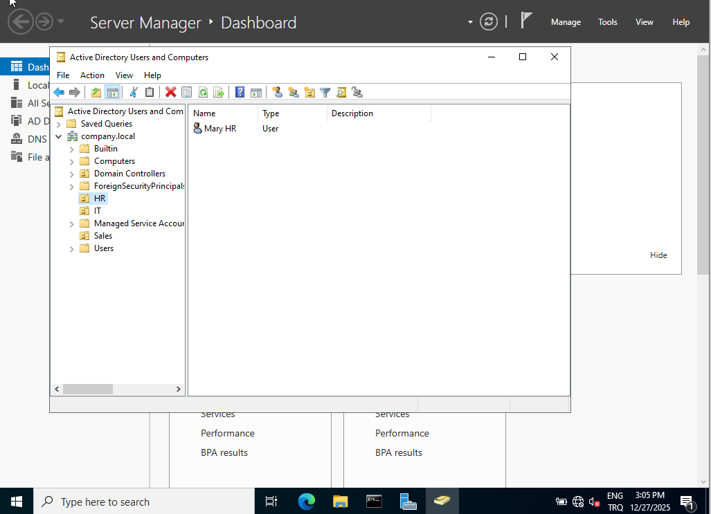
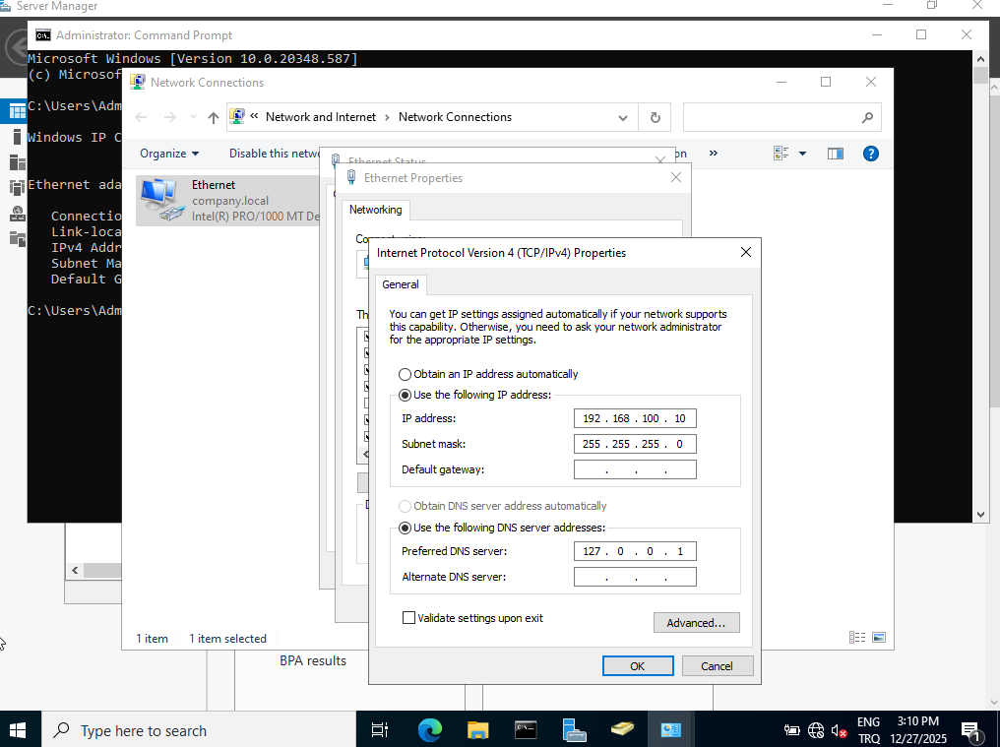

# active-directory-helpdesk-lab
Active Directory home lab demonstrating Windows Server administration and Help Desk troubleshooting.

---

## Configuration Steps

### 1. Windows Server Setup
- Installed Windows Server with Desktop Experience
- Configured the server as a Domain Controller
- Installed and configured:
  - Active Directory Domain Services (AD DS)
  - DNS Server
- Created a new Active Directory domain (`company.local`)
  

---

### 2. Active Directory Configuration
- Created Organizational Units (OUs):
  - IT
  - HR
- Created domain users:
  - john.smith (IT)
  - mary.hr (HR)
- Enforced password change at first logon

---

### 3. Network Configuration
- Configured Internal Network in VirtualBox
- Assigned static IP addresses:
  - Domain Controller: `192.168.100.10`
  - Client PC: `192.168.100.20`
- Configured DNS:
  - Server uses itself as DNS (`127.0.0.1`)
  - Client points DNS to the Domain Controller
    

---

### 4. Client Configuration
- Installed Windows 10 Pro
- Renamed the computer following Windows naming conventions
- Joined the client machine to the domain
- Successfully logged in using a domain user account

---

## Troubleshooting Scenarios

### APIPA Issue
- Identified an APIPA address (`169.254.x.x`) on the server
- Determined that no DHCP or static IP was configured
- Resolved the issue by assigning a static IP address

### DNS Resolution Failure
- Domain name (`company.local`) could not be resolved
- Fixed DNS configuration on the Domain Controller
- Verified resolution using `ping` and DNS tools

### Domain Join Errors
- Resolved domain join failures caused by:
  - Incorrect DNS settings
  - Incorrect username format
- Successfully joined the client using proper domain credentials

---

## Skills Demonstrated
- Active Directory administration
- DNS configuration and troubleshooting
- Windows Server administration
- Windows 10 Pro domain integration
- Network troubleshooting
- Help Desk problem-solving workflow

---

## What I Learned
- How domain authentication depends on proper DNS configuration
- How to identify and resolve APIPA-related network issues
- How real-world Help Desk troubleshooting works step by step
- The importance of systematic problem isolation

---

## Future Improvements
- Add Group Policy Objects (GPO)
- Configure shared folders and NTFS permissions
- Simulate account lockout and password reset tickets
- Add screenshots for each major step

---

## Author
Betul Dulger
